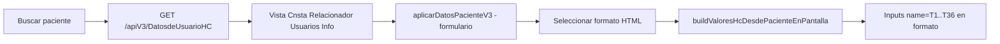

# Campos Historia Clínica — Informe CEERE

Documento de referencia para el módulo **Historias Clínicas** del Relacionador y los formatos HTML en `C:\CeereSio\Formatos HC`.

**Catálogo origen (CeereSio):** `C:\CeereSio\Campos Historia Clínica.txt`  
**Última actualización vista SQL:** `SQL/1888/1888.sql` — `ALTER VIEW [Cnsta Relacionador Usuarios Info]`

---

## 1. Flujo de datos



| Paso | Archivo / recurso |
|------|-------------------|
| Vista SQL | `back_relacionador/SQL/1888/1888.sql` (líneas ~330–429) |
| API paciente | `back_relacionador/server/routes/Asignar_RipsRoutes V3.js` → `GET /apiV3/DatosdeUsuarioHC/:DocumentoPaciente` |
| API debug | `back_relacionador/server/routes/historiasClinicasRoutes.js` → `GET /apiV3/debug/DatosdeUsuarioHC/:documento` |
| Mapeo T → valores | `front_relacionador/public/historiasClinicas/camposHistoriaClinica.js` |
| Serializar formato | `front_relacionador/public/historiasClinicas/serializarFormatoHc.js` |
| Guardar evaluación | `back_relacionador/server/historiasClinicas/guardarEvaluacionEntidad.js` |
| Vista previa formatos | `front_relacionador/public/historiasClinicas/HistoriasClinicas.js` |
| Formato de prueba | `C:\CeereSio\Formatos HC\PRUEBA_CAMPOS_T.html` (copia en `docs/formatos-hc/`) |
| Análisis JSON | `GET /apiV3/formatosHC/analisis-campos` |

**Variable de entorno:** `CEERE_FORMATOS_HC_PATH` (por defecto `C:\CeereSio\Formatos HC`).

---

## 2. Catálogo completo (name HTML → significado)

| Campo `name` | Significado (CeereSio) | Estado | Columna / origen |
|--------------|------------------------|--------|------------------|
| **T1** | Nombre completo | Implementado | `NombreCompletoPaciente` |
| **T2** | No. historia | Implementado | `DocumentoPaciente` |
| **T3** | Edad | Implementado | `Edad` |
| **T4** | Fecha de historia | Implementado | Sistema (fecha actual al abrir formato) |
| **T5** | Identificación | Implementado | Tipo documento + `DocumentoPaciente` |
| **T6** | Dir. domicilio | Implementado | `Direccion` |
| **T7** | Ciudad | Implementado | `NombreMunicipioRecidencia` |
| **T8** | Tel. domicilio | Implementado | `Tel` (`EntidadII` celular) |
| **T9** | Fecha nacimiento | Implementado | `FechaNacimientoBase` |
| **T10** | Sexo | Implementado | `Sexo` / `SexoPaciente` |
| **T11** | Estado civil | Implementado | `EstadoCivil` ← `Estado Civil` + `EntidadIII` |
| **T12** | Ocupación | Implementado | `DescripciónOcupación` |
| **T13** | Aseguradora | Pendiente SQL | — |
| **T14** | Tipo vinculación | Pendiente SQL | — |
| **T15** | Acompañante | Pendiente SQL | — |
| **T16** | Parentesco acompañante | Pendiente SQL | — |
| **T17** | Tel. acompañante | Pendiente SQL | — |
| **T18** | Responsable | Implementado | `NombreResponsable` ← `Entidad` responsable |
| **T19** | Parentesco responsable | Implementado | `ParentescoResponsable` ← `Parentesco` |
| **T20** | Tel. responsable | Pendiente SQL | — |
| **T21** | Nombre de usuario | Implementado | Sesión (`nombreusuariologeado`) |
| **T22** | Hora de historia | Implementado | Sistema (hora actual) |
| **T23** | Lugar nacimiento | Pendiente SQL | — |
| **T24** | Barrio | Pendiente SQL | — |
| **T25** | Teléfono 2 | Pendiente SQL | — |
| **T26** | Celular | Pendiente SQL | — |
| **T27** | Tipo documento | Implementado | `DescripciTipoDocumento` |
| **T28** | Tipo usuario | Pendiente SQL | — |
| **T29** / **RegistroMédico** | Registro médico | Pendiente SQL / sesión | Profesional logueado |
| **T30** | Fecha historia numérica | Implementado | Sistema (`YYYYMMDD`) |
| **T31** | Código dx RIPS | Pendiente SQL | Evaluación / RIPS |
| **T32** | Descripción dx RIPS | Pendiente SQL | Evaluación / RIPS |
| **T33** | Código dx RIPS 2 | Pendiente SQL | Evaluación / RIPS |
| **T34** | Edad gestacional | Pendiente SQL | — |
| **T35** | — | No existe en catálogo | — |
| **T36** | Correo electrónico | Pendiente SQL | — |
| **Entidad1** | Foto paciente | Pendiente imagen | — |
| **Entidad2** | Firma paciente | Pendiente imagen | — |
| **Entidad3** | Firma usuario | Pendiente imagen | — |

**Resumen:** 18 campos T con dato hoy · 16 pendientes (SQL/RIPS/imagen) · 3 campos `Entidad` imagen.

---

## 3. Vista `[Cnsta Relacionador Usuarios Info]`

### 3.1 Columnas actuales en el SELECT de la API

El endpoint `DatosdeUsuarioHC` proyecta (entre otras):

`IdTipodeDocumento`, `DescripciTipoDocumento`, `DocumentoPaciente`, `NombreCompletoPaciente`, `Edad`, `Direccion`, `Tel`, `FechaNacimientoBase`, `Sexo`, datos de país/municipio/zona, etnia, discapacidad, ocupación, alergias, **`EstadoCivil`**, **`NombreResponsable`**, **`ParentescoResponsable`**.

### 3.2 JOINs agregados recientemente (1888.sql)

| Alias columna | Tabla / join |
|---------------|----------------|
| `EstadoCivil` | `[Estado Civil]` ← `EntidadIII.[Id Estado Civil]` |
| `NombreResponsable` | `Entidad Respon` ← `EntidadIII.[Documento Responsable]` |
| `ParentescoResponsable` | `Parentesco` ← `EntidadIII.[Id Parentesco]` |

### 3.3 Tablas base de la vista

- `Entidad`, `EntidadII`, `EntidadIII`, `Entidad1888`, `EntidadVI`
- `Tipo de Documento`, `Sexo`, `Sexo Identidad Genero`
- `País1888`, `Ciudad1888`, `Zona Residencia`, `Etnia`, `Discapacidad`, `Ocupación`
- `Estado Civil`, `Entidad` (responsable), `Parentesco`

---

## 4. Campos pendientes — sugerencia para ampliar la vista

Prioridad sugerida al modificar `ALTER VIEW` y el `SELECT` en `Asignar_RipsRoutes V3.js`:

| Campo T | Posible fuente en BD (validar en SSMS) |
|---------|----------------------------------------|
| T13 | Aseguradora / EPS — `[Evaluación Entidad].[Documento Aseguradora]` o tabla empresa |
| T14 | `[Evaluación Entidad].[Id Tipo de Afiliado]` + catálogo afiliación |
| T15–T17 | `[Acompañante Evaluación Entidad]`, `[Id Parentesco]`, `[Teléfono Acompañante]` (última evaluación) |
| T20 | `[Teléfono Responsable]` en `EntidadIII` o evaluación |
| T23 | Municipio/país nacimiento en `EntidadIII` |
| T24 | `Entidad.[Id Barrio]` → `Barrio` |
| T25 | `EntidadII.[Teléfono No 2 EntidadII]` |
| T26 | `EntidadII.[Teléfono Celular EntidadII]` (si se distingue de T8) |
| T28 | Tipo usuario / régimen |
| T29 | Registro profesional del usuario logueado |
| T31–T33 | Diagnósticos de `[Evaluación Entidad]` o RIPS relacionado |
| T34 | Edad gestacional (si aplica) |
| T36 | `EntidadII.[E-mail Nro 1 EntidadII]` |

Muchos datos de acompañante/aseguradora viven en **`[Evaluación Entidad]`** (última HC), no solo en demografía. Patrón habitual:

```sql
OUTER APPLY (
    SELECT TOP (1) ...
    FROM [Evaluación Entidad] ev
    WHERE ev.[Documento Entidad] = e.[Documento Entidad]
    ORDER BY ev.[Fecha Evaluación Entidad] DESC
) ultEv
```

---

## 5. Checklist al agregar un campo nuevo

1. Agregar columna en `ALTER VIEW [Cnsta Relacionador Usuarios Info]` (`1888.sql`).
2. Ejecutar el `ALTER VIEW` en la base del `.env` (`DB_DATABASE`).
3. Agregar el alias al `SELECT` en `Asignar_RipsRoutes V3.js` (~línea 899).
4. Actualizar `CATALOGO_CAMPOS_HC` y `buildValoresHcDesdePacienteEnPantalla` en `camposHistoriaClinica.js`.
5. Agregar el alias a `CAMPOS_CON_DATO_ACTUAL` en `historiasClinicasRoutes.js` (informe API).
6. Probar con `PRUEBA_CAMPOS_T.html` y `GET /apiV3/debug/DatosdeUsuarioHC/:doc`.

---

## 6. Formatos HTML en carpeta raíz

Solo los `.htm` / `.html` en la **raíz** de `CEERE_FORMATOS_HC_PATH` aparecen en el selector.

| Archivo (ejemplo) | Campos `name` detectados | Autollenado |
|-------------------|------------------------|-------------|
| `PRUEBA_CAMPOS_T.html` | T1–T36, RegistroMédico, Entidad1–3 | Según tabla §2 |
| `Periodontograma.htm` | T1 | T1 |
| `perio.html`, `perio_modificado.html` | Sin `name` | No (agregar `name` al HTML) |

Formatos en subcarpetas (ej. `Viejos/`) no se listan hasta moverlos a la raíz o ampliar el backend.

---

## 7. Guardar historia clínica (`[Evaluación Entidad]`)

Solo **INSERT** (nueva evaluación en cada guardado). Tipo evaluación **4** = formato HC.

### 7.1 Endpoint

```http
POST /apiV3/historiasClinicas/guardar
Content-Type: application/json
```

**Body:**

```json
{
  "documentoPaciente": "1026161053",
  "nombreFormato": "PRUEBA_CAMPOS_T.html",
  "diagnosticoEspecifico": "T1| nombre|False||T2| 1026161053|False||...",
  "fechaEvaluacion": "2026-05-20T11:55:00",
  "session": {
    "documentoUsuario": "123",
    "documentoProfesional": "123",
    "documentoEmpresa": "900063460-1",
    "idTerminal": "1392"
  }
}
```

**Respuesta:** `{ ok: true, idEvaluacionEntidad, fechaEvaluacion, diagnosticoGeneral, cantidadCamposFormato }`

**Código:** `server/historiasClinicas/guardarEvaluacionEntidad.js` · ruta en `historiasClinicasRoutes.js`

### 7.2 Columnas clave en BD

| Columna | Valor |
|---------|--------|
| `[Id Tipo de Evaluación]` | `4` |
| `[Diagnóstico General Evaluación Entidad]` | `\Formatos HC\{nombreArchivo}` |
| `[Diagnóstico Específico Evaluación Entidad]` | Cadena serializada (ver §7.3) |
| `[Id Estado]` | `8` |
| `[Id Estado Web]` | `2` |
| `[Rips]` | `1` si `CEERE_HC_INSERT_RIPS=1` (como Ceere desktop) |

Cabecera demográfica: snapshot desde `[Cnsta Relacionador Usuarios Info]` + campos T15–T20/T13 parseados del diagnóstico específico.

### 7.3 Formato `Diagnóstico Específico` (legacy)

Por cada control con `name` en el HTML del formato:

```text
{name}| {valor}|{True|False}|
```

Bloques unidos con `|` adicional → separador visual `||`:

```text
T1| Fernando F Palacio Suarez|False||T2| 1026161053|False||
```

- Texto / select / textarea: tercer token `False`.
- Checkbox / radio marcado: `True`; radio sin marcar no se incluye.
- Orden: recorrido DOM (`querySelectorAll`) — sirve para **cualquier** formato con `name`.

**Serialización frontend:** `front_relacionador/public/historiasClinicas/serializarFormatoHc.js`

### 7.4 Variables `.env`

| Variable | Uso |
|----------|-----|
| `CEERE_ID_TERMINAL` | `[Id Terminal]` (default `1392`) |
| `CEERE_HC_INSERT_RIPS` | `1` incluye `[Rips]=1`; `0` omite columna |

### 7.5 UI

Botón **Guardar historia clínica** en `HistoriasClinicas.html` → serializa iframe → POST guardar.

---

## 8. Panel evoluciones previas (izquierda)

Lista las HC del paciente en `[Evaluación Entidad]` con `[Id Tipo de Evaluación] = 4`:

| Id Estado | Etiqueta en UI |
|-----------|----------------|
| **8** | Abierto (badge verde) |
| **7** | Cerrado (badge amarillo) |

- `GET /apiV3/historiasClinicas/evoluciones/{documentoPaciente}`
- `GET /apiV3/historiasClinicas/evoluciones/detalle/{idEvaluacionEntidad}` — al hacer clic carga el formato guardado en la vista previa
- `POST /apiV3/historiasClinicas/cerrar` — **UPDATE** `[Id Estado]` de **8** (Abierto) a **7** (Cerrado); body: `{ "idEvaluacionEntidad": 123 }`
- Frontend: `evolucionesPacienteHc.js` + columna izquierda en `HistoriasClinicas.html`
- Botón **Cerrar HC** (solo habilitado con una evolución **Abierta** seleccionada en la lista); tras cerrar queda solo lectura.

---

## 8.1 RIPS anclado a la evolución activa (Historias Clínicas)

En **Historias Clínicas** el bloque *Historia clínica, tipo de RIPS y asignación* no usa el select `HistoriasSinRIPS` de Asignar RIPS V3. La HC activa es la seleccionada en el panel **Evoluciones previas** (o el borrador **Sin guardar**).

| Situación | RIPS |
|-----------|------|
| Sin paciente / sin evolución | Card deshabilitada |
| Borrador **Sin guardar** | Formulario RIPS editable en panel flotante; guardar HC desde el botón principal |
| HC **Abierta** con id | Diligenciar RIPS / RIPS por defecto (registro en BD fuera de este panel) |
| HC **Cerrada** o con RIPS ya asignado | Solo lectura en formulario RIPS |

**Tabla:** `[Evaluación Entidad Rips]` — FK `[Id Evaluación Entidad]`.

**APIs (módulo historiasClinicas):**

```http
GET  /apiV3/historiasClinicas/rips/evaluacion/:idEvaluacionEntidad
POST /apiV3/historiasClinicas/rips/registrar
POST /apiV3/historiasClinicas/rips/sin-registrar
```

**Frontend:** `shared/rips/*.js`, `historiasClinicas/ripsHc.js`, card cargada desde `historiasClinicas/ripsHcCard.fragment.html`. Catálogos y RIPS por defecto reutilizan los mismos endpoints `/apiV3/*` que Asignar RIPS V3.

**Factura / presupuesto:** mismos controles de la card de selección de paciente (`BuscarPorFacturas`, `FacturaARelacionar`, etc.).

**UI flotante:** botón circular fijo (esquina inferior derecha) abre un panel lateral con el formulario RIPS. Los datos permanecen al cerrar el panel. Opción **Exigir RIPS antes de guardar HC** (checkbox en el panel; preferencia en `localStorage` clave `hc_rips_exigir_antes_guardar`): si está activa, no permite guardar la HC hasta RIPS completo, registrado o marcado sin RIPS.

### Checklist de pruebas manuales (RIPS en HC)

1. Paciente con factura → **Nueva evolución** (borrador) → diligenciar formato + RIPS AC o AP en panel flotante → **Guardar historia clínica**.
2. Abrir HC **Abierta** existente → panel RIPS muestra ancla y formulario coherente con la evolución.
3. Opción **Exigir RIPS antes de guardar HC** bloquea guardado si el formulario RIPS está incompleto.
4. **Cerrar HC** → formulario RIPS y botones deshabilitados.
5. Intentar segundo RIPS en la misma evaluación → bloqueado con mensaje (GET rips previo).
6. Tras desplegar rutas nuevas: reiniciar `node server.js` y recargar Historias Clínicas (Ctrl+F5).

---

## 9. Referencias rápidas

```http
GET /apiV3/DatosdeUsuarioHC/{documento}
GET /apiV3/debug/DatosdeUsuarioHC/{documento}
GET /apiV3/formatosHC
GET /apiV3/formatosHC/analisis-campos
GET /apiV3/formatosHC/vista/{nombreArchivo}
GET /apiV3/historiasClinicas/evoluciones/{documentoPaciente}
GET /apiV3/historiasClinicas/evoluciones/detalle/{idEvaluacionEntidad}
POST /apiV3/historiasClinicas/guardar
POST /apiV3/historiasClinicas/cerrar
GET  /apiV3/historiasClinicas/rips/evaluacion/:idEvaluacionEntidad
POST /apiV3/historiasClinicas/rips/registrar
POST /apiV3/historiasClinicas/rips/sin-registrar
```

```sql
-- Ver definición en servidor
EXEC sp_helptext 'Cnsta Relacionador Usuarios Info';

-- Probar un paciente
SELECT TOP 1 *
FROM [Cnsta Relacionador Usuarios Info]
WHERE DocumentoPaciente = '1026161053';
```

---

*Mantenimiento: al cambiar la vista o el mapeo JS, actualizar este archivo y la fila correspondiente en §2.*
