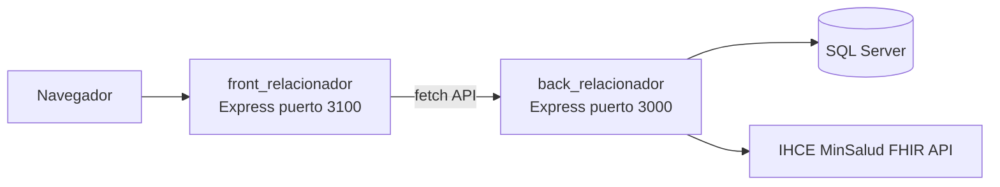

# Contexto del proyecto NUEVO_RELACIONADOR

Documento de onboarding para IAs y desarrolladores. Resume qué es el sistema, cómo está organizado y qué se ha trabajado recientemente (marzo–junio 2026).

---

## 1. ¿Qué es este proyecto?

**Relacionador RIPS** es una aplicación interna de **Ceere** para clínicas/IPS en Colombia. Permite:

1. **Asignar RIPS** (Resolución 2275) a historias clínicas (AC/AP).
2. **Relacionar** historias clínicas con facturas (particular o EPS/prepagada).
3. **Generar y descargar** archivos RIPS (JSON/ZIP) y XMLs de facturación.
4. **RDA** — Resumen Digital de Atención (Resolución **1888**): armar bundles FHIR y enviarlos a **IHCE** (MinSalud).
5. **Visor IHCE** — consultar RDAs ya enviados al ministerio.
6. **Desrelacionar** vínculos HC ↔ RIPS cuando hace falta corregir.

**Stack:** Node.js + Express, SQL Server (`tedious` / `mssql`), frontend HTML/JS (Bootstrap 5, jQuery, Select2, SweetAlert2). Sin framework SPA (React/Vue).

**Repositorio:** `https://github.com/CeereIngeniero1/NUEVO_RELACIONADOR.git`

---

## 2. Arquitectura en dos servidores



| Componente | Ruta | Puerto | Rol |
|------------|------|--------|-----|
| Frontend estático | `front_relacionador/` | **3100** (`app.js`) | Sirve HTML/JS/CSS, login, SSE opcional |
| Backend API | `back_relacionador/` | **3000** (`server/server.js`) | REST, FHIR, IHCE, SQL |

**Configuración:** cada parte tiene su `.env`. El front resuelve la URL del backend vía `NombreEquipoServidor.js` → `localStorage.NombreEquipoServidor` y `window.getApiBaseUrl()`.

**Autenticación:** JWT en `localStorage` (`token`, `token_exp`). Rutas protegidas con header `Authorization`. Login: `POST /api/login`.

---

## 3. Estructura de carpetas (esquema)

```
NUEVO_RELACIONADOR/
├── contexto/                    ← este documento
├── docs/                        ← documentación técnica (arquitectura, RDA, API)
├── front_relacionador/
│   ├── app.js                   ← servidor Express del front (3100)
│   ├── .env
│   └── public/
│       ├── index.html           ← login
│       ├── RIPS.html + RIPS.js  ← relación HC ↔ factura (pantalla principal post-login)
│       ├── Asignar_RIPS V3.html/js  ← asignación RIPS + RDA (pantalla activa V3)
│       ├── HistoriasClinicas.html
│       ├── Desrelacionar.html
│       ├── EnvioRdaPendientes.html
│       ├── rda/                 ← módulo ES RDA 1888 (index.js, state, ui, api, asignar/)
│       ├── visor/               ← visor IHCE ministerio (visor.html, consultas_rda.js)
│       ├── desrelacionador/
│       ├── shared/
│       └── style.css            ← design system + tema oscuro
└── back_relacionador/
    ├── .env                     ← NO commitear
    ├── jsons/                   ← JSON archivados de envío IHCE (gitignored)
    │   └── sandbox|produccion/{CC_doc_NombrePaciente}/
    ├── server/
    │   ├── server.js            ← montaje de rutas
    │   ├── routes/              ← routers por dominio
    │   │   ├── rda/             ← RDA Paciente, CE, envío masivo
    │   │   ├── infoPacientesRoutes.js
    │   │   ├── epsRoutes.js
    │   │   ├── Asignar_RipsRoutes V3.js
    │   │   ├── desrelacionadorRoutes.js
    │   │   └── VisorIhceRoutes.js
    │   ├── rda/                 ← lógica compartida FHIR (secciones CE, validación, PDF, archivo JSON)
    │   ├── services/            ← IHCE HTTP agent, credenciales visor
    │   └── config/envLoader.js
    ├── SQL/                     ← scripts BD (1888, triggers RIPS automáticos, catálogos)
    └── test/                    ← tests node:test (validación bundle, secciones, archivo JSON)
```

---

## 4. Módulos funcionales principales

### 4.1 Asignar RIPS V3 (activo)

- **UI:** `front_relacionador/public/Asignar_RIPS V3.html`
- **JS RIPS:** `Asignar_RIPS V3.js` — catálogos, registro AC/AP, paciente.
- **JS RDA:** `front_relacionador/public/rda/` (entry `rda/index.js`, expone `window.RDA`).
- **API:** prefijo `/apiV3` (`Asignar_RipsRoutes V3.js`), catálogos 1888, `RegistrarRips`.
- **Generaciones obsoletas:** V1/V2 (`Asignar_RIPS.html`, `RIPS V2.html`) — coexisten pero no son el foco.

### 4.2 Relación Historia Clínica y Facturación (`RIPS.html`)

Vincula `[Evaluación Entidad Rips]` con `Factura` y/o plan de tratamiento EPS.

**Dos modos (checkboxes):**

| Modo | Flujo UI (rediseñado 2026) | APIs clave |
|------|----------------------------|------------|
| **Particular** | Rango fechas → panel izq. facturas → clic → panel der. RIPS pendientes → RELACIONAR | `GET /api/facturasRango/...`, `GET /api/evaluaciones/...`, `POST /api/relacionar` |
| **Prepagada/EPS** | Rango → select factura EPS → panel izq. atenciones/pacientes → clic → panel der. RIPS → RELACIONAR | `GET /api/EPS/...`, `GET /api/PacientesTratamientosFacturaEps/...`, `GET /api/RipsPacientesTratamientosEps/...`, `POST /api/relacionarEPS/...` |

Archivos: `RIPS.html`, `RIPS.js`, `infoPacientesRoutes.js`, `epsRoutes.js`.

### 4.3 RDA — Resolución 1888 + IHCE

Dos tipos de RDA:

| Tipo | Perfil FHIR | Operación IHCE | Rutas backend |
|------|-------------|----------------|---------------|
| **RDA Paciente** | sin Encounter | `$enviar-rda-paciente` | `server/routes/rda/RdaPacienteRoutes.js` |
| **RDA Consulta Externa** | `CompositionAmbulatoryRDA` + Encounter | `$enviar-rda-consulta` | `server/routes/rda/RdaConsultaExternaRoutes.js` |

**Flujo típico CE:**

1. Usuario completa formulario en Asignar RIPS V3 (sección RDACE).
2. Guarda en BD tablas `Evaluacion Entidad RDA CE *`.
3. `POST /apiV3/RdaConsultaExterna/FhirBundle` construye Bundle document.
4. `POST /apiV3/RdaConsultaExterna/EnviarIHCE` envía a IHCE (sandbox/prod según `ambiente` en body).
5. JSON enviado se archiva en `back_relacionador/jsons/{sandbox|produccion}/{carpeta_paciente}/`.

**Lógica FHIR compartida** (`back_relacionador/server/rda/`):

- `rdaceCompositionSections.js` — 9 secciones LOINC obligatorias CE.
- `rdaceBundleIhceValidation.js` — validaciones pre-envío (p. ej. no `MedicationRequest` con `reportedBoolean` en CE).
- `rdaEnvioJsonArchive.js` — guardado JSON; nombre archivo: `{cedula}_{CE|PAC}_{YYYYMMDD_HHMMSS}.json`.
- `fhirColombiaFormat.js` — fechas Colombia `-05:00`, conversión SQL.

### 4.4 Antecedentes en RDA Consulta Externa (decisión IHCE)

IHCE rechaza `MedicationRequestRDA` incompletos para antecedentes farmacológicos. Por eso:

| Tipo antecedente | Cómo va al bundle FHIR | Cómo lo muestra el visor |
|------------------|------------------------|---------------------------|
| Farmacológicos | Narrativa en sección LOINC `10160-0` | Tarjeta dedicada en visor |
| Salud (personales) | `Condition` + narrativa en `11450-4` | Tarjeta + sección Diagnósticos |
| Familiares | Solo narrativa en `11450-4` (no `FamilyMemberHistory` en CE) | Tarjeta dedicada |

Prescripciones del plan sí van como `MedicationRequest` con dosificación desde catálogos BD.

### 4.5 Visor IHCE

- **UI embebida:** modal desde Asignar RIPS (`ihceVisorModal.js`, `?embed=1`).
- **UI amplia:** `front_relacionador/public/visor/visor.html` + `consultas_rda.js`.
- **Backend:** `VisorIhceRoutes.js`, `ihceVisorHttpsAgent.js`.
- **Importación al formulario:** `rda/visor/ihceAntecedentesImport.js` (postMessage desde visor embed).

Incluye visor PDF (pdf.js) para epicrisis / `DocumentReference`.

### 4.6 Desrelacionador

- `Desrelacionar.html` + `/apiV3/relacionesRipsDesrelacionador/*`
- Revierte vínculo HC ↔ RIPS o quita factura sin borrar RIPS.

### 4.7 Envío masivo RDA

- `EnvioRdaPendientes.html` + `RdaEnvioMasivoRoutes.js`

---

## 5. Base de datos (tablas frecuentes)

| Tabla / concepto | Uso |
|------------------|-----|
| `[Evaluación Entidad]` | Historia clínica |
| `[Evaluación Entidad Rips]` | RIPS; campos `Id Factura`, `Id Plan de Tratamiento`, `Id Evaluación Entidad` |
| `Factura`, `FacturaII` | Facturación particular y líneas EPS |
| `[Plan de Tratamiento]` | Planes prepagada/EPS |
| `Evaluacion Entidad RDA` / `Evaluacion Entidad RDA CE *` | Cabecera y detalle RDA 1888 |
| Triggers en `SQL/` | Auto-relación factura/RIPS en algunos escenarios |

Catálogos 1888: tablas/vistas `Cnsta * 1888`, scripts en `back_relacionador/SQL/1888/`.

---

## 6. Prefijos API (backend)

| Prefijo | Uso |
|---------|-----|
| `/api` | Login, pacientes particulares, EPS, relación RIPS legacy, maestro listas |
| `/apiV2` | Compatibilidad asignar RIPS V2 |
| `/apiV3` | **Activo:** asignar RIPS V3, historias clínicas, desrelacionador, visor IHCE, RDA |
| `/RIPS` | Descarga JSON/ZIP RIPS |
| `/XMLS` | Facturación electrónica (Facturatech, Fenalco) |

RDA montado bajo `/apiV3` vía routers en `Asignar_RipsRoutes V3.js` (require de `routes/rda/*`).

Documentación detallada: `docs/arquitectura/api_endpoints.md`.

---

## 7. Trabajo reciente (sesiones de desarrollo 2026)

Commits relevantes en `main`:

### `6ef163e` — RDA CE, visor IHCE, antecedentes narrativos

- Antecedentes farmacológicos CE como narrativa en `10160-0` (no `MedicationRequest` sin dosificación).
- Antecedentes salud/familiares como narrativa en `11450-4`.
- Visor: tarjetas de antecedentes, import desde IHCE, visor PDF.
- `rdaceBundleIhceValidation.js`, tests.
- Archivo JSON IHCE por carpeta de paciente en `jsons/`.
- Fechas Colombia en `fhirColombiaFormat.js`.

### `3c47e2e` — Relación RIPS dos paneles + modal factura

- `RIPS.html` / `RIPS.js`: UI de dos paneles (Particular y Prepagada).
- `GET /api/facturasRango/:fechaInicio/:fechaFin/:documentoEmpresa`.
- Nombres de JSON: `{cedula}_{CE|PAC}_{fecha_hora_RDA}.json`.
- Estilos modal “Ver factura” legible en tema oscuro.

### Temas recurrentes de soporte

- Reiniciar `node server.js` (backend) tras cambios en rutas/RDA.
- Bundles **ya enviados** a IHCE no tienen narrativa nueva; hay que re-guardar y re-enviar.
- `.env` y `jsons/` **no** van a git.

---

## 8. Cómo arrancar en local

```bash
# Terminal 1 — Backend
cd back_relacionador
node server.js          # puerto 3000

# Terminal 2 — Frontend
cd front_relacionador
node app.js             # puerto 3100
```

Abrir navegador en la URL del front (típicamente `http://localhost:3100`). Tras login → `RIPS.html` o menú hacia Asignar RIPS V3.

**Tests backend (ejemplos):**

```bash
cd back_relacionador
node --test test/rdaceCompositionSections.test.js
node --test test/rdaceBundleIhceValidation.test.js
node --test test/rdaEnvioJsonArchive.test.js
```

---

## 9. Convenciones para contribuir

- **RDA front:** módulos ES en `front_relacionador/public/rda/`; estado en `state.js`; no mezclar lógica RDA pesada en `Asignar_RIPS V3.js`.
- **RDA backend:** lógica FHIR en `server/rda/`; rutas HTTP en `server/routes/rda/`.
- **Versiones:** preferir V3 (`/apiV3`); V1/V2 solo si el usuario aún usa pantallas legacy.
- **IHCE:** perfiles en `https://fhir.minsalud.gov.co/rda/`; validar bundle antes de enviar.
- **Commits:** no incluir `.env`, `jsons/`, ni `.env copy`.
- **Estilos UI:** variables CSS en `style.css`; tema oscuro con `[data-theme="dark"]`.

---

## 10. Documentación adicional en el repo

| Ruta | Contenido |
|------|-----------|
| `docs/arquitectura/arquitectura_actual_resumen.md` | Arquitectura detallada |
| `docs/arquitectura/api_endpoints.md` | Listado de endpoints |
| `front_relacionador/public/rda/README.md` | Mapa del módulo RDA front |
| `docs/desrelacionador/descripcion.md` | Desrelacionador |
| `docs/resolucion-1888/rda_paciente.md` | RDA paciente |

---

## 11. Preguntas frecuentes para otra IA

**¿Dónde se construye el bundle FHIR de consulta externa?**  
`RdaConsultaExternaRoutes.js` + helpers en `server/rda/`.

**¿Por qué no aparecen antecedentes familiares como recurso FHIR en CE?**  
El perfil CE no permite `FamilyMemberHistory` en el slicing; van como texto narrativo en sección `11450-4`.

**¿Dónde está el visor del ministerio?**  
`front_relacionador/public/visor/` y rutas `VisorIhceRoutes.js`.

**¿Qué pantalla usa el usuario para relacionar facturas?**  
`RIPS.html` (no confundir con Asignar RIPS V3, que es para crear RIPS y RDA).

**¿RIPS V2 sigue en uso?**  
Existe (`RIPS V2.html`, `/apiV2`); el rediseño de dos paneles se hizo en `RIPS.html` + `/api` (V1 path). Replicar en V2 si producción aún lo usa.

---

*Última actualización: junio 2026. Mantener este archivo al hacer cambios arquitectónicos relevantes.*
