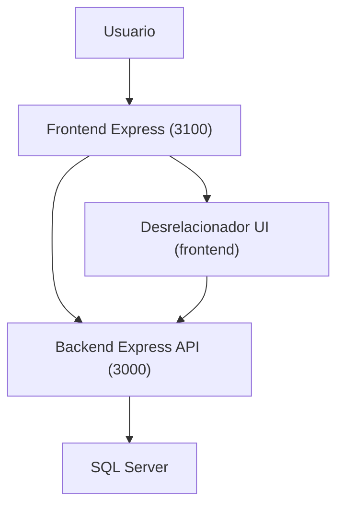

##17-03-2026
## Arquitectura actual — Resumen ejecutivo

Este documento resume cómo está construido hoy el proyecto `NUEVO_RELACIONADOR` (frontend + backend) y deja explícito dónde encaja el módulo RDA V3, de cara a futuras refactorizaciones (por ejemplo, migrar RDA a módulos ES).

---

## 1. Visión general del proyecto

- **Frontend (`front_relacionador`)**
  - Servidor Express propio (puerto `3100`) definido en `app.js`.
  - Sirve archivos estáticos desde `front_relacionador/public` (HTML, CSS, JS).
  - Gestiona login, navegación principal y la pantalla de asignación de RIPS (V3).
  - Nota SSE: la ruta `GET /api/sse` existe también en `back_relacionador/server/server.js` (además de `front_relacionador/app.js`). Mantener la URL base consistente evita apuntar al servidor equivocado.

- **Backend (`back_relacionador`)**
  - Otro servidor Express (puerto `3000`) con rutas REST para:
    - Autenticación (`/api/login`).
    - Pacientes, historias clínicas y facturas (`/apiV3`, `/apiV2`, `/apiv2`).
    - Asignación de RIPS (tres generaciones de rutas: V1, V2, V3 activa).
    - Catálogos RIPS y catálogos específicos de la Resolución 1888.
    - Generación/descarga de RIPS en JSON y XMLs de facturación.
  - Base de datos SQL Server a través de `tedious`, con scripts SQL y procesos de actualización de catálogos.

---

## 2. Frontend — Capas y generaciones

- **Generaciones de la pantalla de asignación**
  - V1: `Asignar_RIPS.html` + `Asignar_RIPS.js` (obsoleta).
  - V2: `Asignar_RIPS V2.html` + `Asignar_RIPS V2.js` (obsoleta).
  - **V3 (activa)**: `Asignar_RIPS V3.html` + `Asignar_RIPS V3.js` + `rda-v3.js`.

- **Archivos principales V3 (activos)**
  - `Asignar_RIPS V3.html`: HTML de la pantalla principal (paciente, RIPS AC/AP, RDA).
  - `Asignar_RIPS V3.js`: lógica de RIPS (Res. 2275), selects, carga de datos del paciente, integración con backend `/apiV3`, `/apiV2`, `/RIPS`.
  - `rda-v3.js`: módulo independiente de RDA (Res. 1888), con:
    - Biometría (IMC).
    - Control de flujo para mostrar/ocultar secciones RDA.
    - Listas dinámicas RDA Paciente y RDA Consulta Externa.
    - API pública controlada a través de `window.RDA`.
  - `NombreEquipoServidor.js`: resuelve y guarda el nombre/URL del backend en `localStorage`.
  - `MaestroListasRIPS.js`: consumo de catálogos RIPS.
  - `index.html`, `RIPS.html` + sus JS asociados para login y navegación.

- **Orden de carga en `Asignar_RIPS V3.html`**
  - Librerías externas (SweetAlert2, Bootstrap, Alertify, etc.).
  - Configuración (`NombreEquipoServidor.js`).
  - Lógica principal RIPS (`Asignar_RIPS V3.js`).
  - **Módulo RDA (`rda-v3.js`) al final del `<body>`**, ejecutado cuando el DOM ya está listo.

- **API pública de `rda-v3.js`**
  - El archivo se auto-encapsula en una IIFE y expone solo:
    - `window.RDA.getAntecedentes()`
    - `window.RDA.getAntecedentesFamiliares()`
    - `window.RDA.getMedicamentos()`
    - `window.RDA.getDiagRelacionados()`
    - `window.RDA.getPrescripcionMedicamentos()`
    - `window.RDA.getPrescripcionProcedimientos()`
    - `window.RDA.getOtrasTecnologias()`
  - Esto permite que `Asignar_RIPS V3.js` consulte las listas RDA sin acoplarse al detalle de implementación.

---

## 2.1 Ruta V3 activa y flujo end-to-end

### Ruta V3 activa
- Frontend V3: `front_relacionador/public/Asignar_RIPS V3.html` + `front_relacionador/public/Asignar_RIPS V3.js` (con `front_relacionador/public/rda-v3.js`).
- Prefijos de API usados desde V3: `/apiV3` (catálogos 1888 y acciones como `RegistrarRips`), `/apiV2` (compatibilidad/datos) y `/RIPS` (descarga JSON/ZIP).

### Flujo end-to-end (incluye Desrelacionador opcional)

## 3. Backend — Capas principales

- **Punto de entrada**
  - `back_relacionador/server/server.js`: configura Express, CORS, middlewares, rutas, y usa `db.js`/`db2.js` para conectarse a SQL Server.

- **Rutas por dominio**
  - `Asignar_RipsRoutes.js`, `Asignar_RipsRoutes V2.js`, `Asignar_RipsRoutes V3.js`: tres versiones coexistentes para asignación de RIPS; `/apiV3` es la activa e incluye soporte para catálogos 1888.
  - `infoPacientesRoutes.js`, `infoPacientesRoutes V2.js`: patients/facturas particulares.
  - `MaestroListasRipsRoutes.js`: catálogos maestros de RIPS.
  - `descargarArchivosRIPSRoutes.js`, `descargarArchivosRIPSRoutes V2.js`: generación/descarga de JSON RIPS.
  - Rutas para EPS, XMLs de facturación electrónica y facturador.

- **Persistencia y scripts SQL**
  - Carpeta `SQL/` con scripts de creación de tablas, vistas, triggers y utilidades (incluyendo tablas 1888).
  - Carpeta `QUERYS_ACTUALIZAR_CODIGOS_LOCALIZACION/` con cargas masivas de municipios, barrios, etc.

## 3.1 Desrelacionador RIPS (V3)

El **Desrelacionador RIPS** permite revertir/desvincular un vínculo entre una **historia clínica (HC)** y un **RIPS**, para que el registro vuelva a quedar en el flujo de pendientes de asignación.

- UI (frontend):
  - Página: `front_relacionador/public/Desrelacionar.html`
  - Módulo JS: `front_relacionador/public/desrelacionador/index.js`
  - Cliente de API: `front_relacionador/public/desrelacionador/api/relacionesRipsApi.js`
- Endpoints backend (prefijo `/apiV3`, implementados en `back_relacionador/server/routes/Asignar_RipsRoutes V3.js`):
  - `GET /apiV3/relacionesRipsDesrelacionador/:documentoPaciente/:documentoUsuario/:fechaInicio/:fechaFin`
  - `GET /apiV3/relacionesRipsDesrelacionador/pacientes/:documentoUsuario/:fechaInicio/:fechaFin`
  - `DELETE /apiV3/relacionesRipsDesrelacionador` (elimina vínculo HC↔RIPS) con body:
    - `idRipsRelacion` (number)
    - `documentoPaciente` (string)
  - `PATCH /apiV3/relacionesRipsDesrelacionador/factura` (quita factura/plan sin borrar vínculo HC↔RIPS) con body:
    - `idRipsRelacion` (number)
    - `documentoPaciente` (string)

> Nota: la columna “Factura relacionada” que muestra la UI proviene de los campos `Id Factura` / `Id Plan de Tratamiento` existentes en la tabla SQL Server `[Evaluación Entidad Rips]`.  
> En algunas instalaciones hay triggers SQL (ver `back_relacionador/SQL/1. SCRIPT PARA RIPS AUTOMATICOS.sql`, por ejemplo `[dbo].[Relacion_Factura_Rips]`) que pueden **auto-asociar** factura/plan al insertar un RIPS, sin intervención del usuario.

---

## 4. Rol actual de RDA V3 dentro de la arquitectura

- **Responsabilidad de `rda-v3.js`**
  - Gestión de UI y estado en memoria para todo lo relacionado con la Resolución 1888:
    - Biometría.
    - Control de flujo de secciones RDA.
    - Listas dinámicas (antecedentes, medicamentos, diagnósticos relacionados, prescripciones, otras tecnologías).
  - Todavía tiene **pendiente**:
    - Construcción del **JSON 1888 final** (sección “Generación JSON 1888” marcada como TODO).
    - Llamadas a una API específica para guardar/consultar datos de RDA (sección “API (fetch exclusivos de RDA)” también en TODO).

- **Acoplamientos**
  - Se apoya directamente en el DOM (`document.getElementById`, `querySelectorAll`) con IDs normalizados (`RDA_...`, `RDACE_...`).
  - Su único punto de contacto “formal” con otros módulos es `window.RDA`.
  - Actualmente no importa ni es importado por otros archivos; se basa en el orden de ``.
- Cualquier lógica nueva de JSON 1888 y API específica de RDA se organice en archivos separados y se importe desde ese `index.js`.

---

## 6. Propuesta de organización interna para RDA (futuro cercano)

Sin cambiar la estructura general del proyecto, se propone para RDA:

- **Estructura sugerida**
  - `public/rda/state.js` — estado centralizado de listas RDA y helpers de acceso.
  - `public/rda/ui/biometria.js` — inicialización de eventos y cálculo de IMC.
  - `public/rda/ui/controlRda.js` — manejo de checkbox “Generar RDA” y radios de tipo.
  - `public/rda/ui/listasPaciente.js` — listas dinámicas de RDA Paciente.
  - `public/rda/ui/listasConsultaExterna.js` — listas dinámicas de RDA Consulta Externa.
  - `public/rda/ui/renderBadges.js` — renderizado genérico de badges para listas (evita duplicar lógica).
  - `public/rda/json/build1888.js` — construcción del JSON final de RDA según tipo.
  - `public/rda/api/entidad1888.js` — funciones `saveRda`, `getRda`, etc., hacia el backend.
  - `public/rda/index.js` — punto de entrada `type="module"`:
    - Importa los módulos anteriores.
    - Ejecuta las funciones de inicialización cuando el DOM está listo.
    - Expone `window.RDA` como fachada para el resto de la app.

- **Cambios mínimos en el HTML**
  - En `Asignar_RIPS V3.html`, reemplazar:
    - ``
    - por ``
  - Manteniendo el mismo lugar (al final del `<body>`) para conservar el flujo actual.

---

## 7. Resumen

- El proyecto ya está **modularizado conceptualmente**: frontend V3 separado de versiones antiguas, backend con rutas por dominio y documentación clara en `docs/arquitectura`.
- RDA V3 está aislado en un único archivo (`rda-v3.js`) con una API global `window.RDA`, lo que facilita sustituir su implementación interna sin romper el resto del sistema.
- Dado que el frontend se sirve via HTTP y que el resto de módulos se comunican solo a través de `window.RDA`, **la opción de migrar RDA a módulos ES (Ruta B) es compatible y recomendable** para las nuevas funcionalidades (JSON 1888 y API RDA), siempre que se mantenga el contrato público existente.

