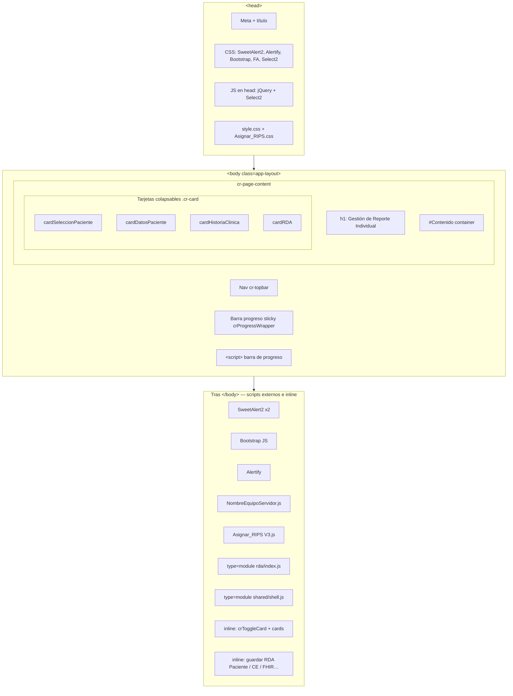

# Estructura visual — `Asignar_RIPS V3.html`

Documento de referencia para entender **qué hay dentro** de la pantalla principal de asignación RIPS V3 y **dónde conviene refactorizar** sin leer ~2400 líneas seguidas.

- **Archivo:** `front_relacionador/public/Asignar_RIPS V3.html`
- **Orden de magnitud:** ~2 422 líneas (mayormente HTML de formularios + bloques RDA)
- **Lógica “pesada”:** en `Asignar_RIPS V3.js` y, para RDA, en el módulo `public/rda/` (ES modules)

---

## 1. Vista de árbol (alto nivel)



> **Nota:** Varias etiquetas `<script>` están **después de `</body>`**. Los navegadores lo toleran, pero es poco habitual y puede confundir al mantener el archivo.

---

## 2. `<head>` — dependencias

| Recurso | Propósito |
|--------|-----------|
| Google Fonts | Tipografías |
| `@sweetalert2/theme-dark` | Tema oscuro SweetAlert |
| Alertify CSS | Diálogos legacy |
| Bootstrap CSS | Layout / componentes |
| Font Awesome | Iconos |
| Select2 CSS | Selects enriquecidos |
| **jQuery + Select2 JS** (en `<head>`) | Base para Select2 y código que usa `$` |
| `style.css` | Tokens y estilos globales CEERE |
| `Asignar_RIPS.css` | Overrides específicos de esta pantalla |

---

## 3. Cuerpo — bloques fijos (fuera del contenedor principal)

### 3.1 Barra superior `#crTopbar`

- Marca, título “Relacionador RIPS”
- Enlaces: Inicio (`RIPS.html`), Asignar RIPS (activo), **Desrelacionar** (`Desrelacionar.html`)
- `#TopbarUserName`, `#crBtnThemeToggle` (tema)

### 3.2 Barra de progreso `#crProgressWrapper` (sticky bajo la topbar)

- `#crProgressText`, `#crProgressBar`, `#crProgressBadge`
- **Script inline** (antes del `</body>`): recorre inputs/selects de `.cr-card-body` y calcula % de diligenciamiento según AC / AP / RDA marcados

### 3.3 Contenedor de página `#Contenido`

Dentro: botón flotante `#RegresarAPrincipal` + **cuatro tarjetas principales** (ver §4).

---

## 4. Tarjetas colapsables (`.cr-card`)

Cada tarjeta usa `onclick="crToggleCard('id')"`. El estado colapsado se guarda en `sessionStorage` (`crCardStates`) vía script al final del archivo.

| # en comentario | `id` | Título en UI | Contenido resumido |
|-----------------|------|--------------|-------------------|
| CARD 1 | `cardSeleccionPaciente` | Selección de paciente | `#listaHC`, `#BotonConsultar`, checkboxes facturas/presupuestos, `#FacturaARelacionar`, `#PresupuestoARelacionar`, **modal** `#exampleModal` (rango fechas HC sin RIPS) |
| CARD 2 | `cardDatosPaciente` | Datos del paciente | Identificación, nombres, fechas, sexo, país/municipio, talla/peso/IMC, dirección, etnia, discapacidad, ocupación, alergias, `#BtnActualizarPaciente`, etc. (IDs tipo `DocumentoPaciente`, `TipoDocumentoBase`, …) |
| CARD 3 | `cardHistoriaClinica` | Historia clínica, tipo RIPS y asignación | `#HistoriasSinRIPS`, radios `#AC` / `#AP`, modal **RIPS por defecto** `#ModalRIPSPorDefecto` con paneles `#ACPorDefecto` / `#APPorDefecto`, bloques largos de selects RIPS (consulta y procedimiento), diagnósticos, `#btnRegistrarRIPS`, `#BtnNoRegistrarRIPS` |
| CARD 5 | `cardRDA` | Resumen Digital de Atención (RDA) | `#GenerarRDABase` (oculto), `#RDA_BtnGenerar`, radios tipo RDA `#RDATipoPaciente` / `#RDATipoConsultaExterna`, contenedor `#ContenidoRDA` con `#SeccionRDAPaciente` y `#SeccionRDAConsultaExterna` (cientos de campos `RDA_*` y `RDACE_*`) |

> En los comentarios del HTML, la tarjeta de historia aparece como **“CARD 3”** y RDA como **“CARD 5”** (no hay CARD 4 en los comentarios; es solo convención histórica).

---

## 5. CARD RDA (`#cardRDA`) — estructura interna

```text
#cardRDA
├── header: Generar RDA, toggle colapsar
└── .cr-card-body
    ├── .rda-toolbar: #ContenedorTipoRDA (RDA Paciente | RDA Consulta Externa)
    └── #ContenidoRDA (inicialmente .d-none)
        ├── #SeccionRDAPaciente (.d-none)
        │   ├── Prestador / Admin plan / fechas / profesional
        │   ├── Modalidad, grupo servicios (1888 / FHIR)
        │   ├── CIE-11 diagnóstico ingreso
        │   ├── Alergia, antecedentes, familiares, medicamentos (listas + botones)
        │   ├── Botón guardar (ej. #RDA_BtnGuardarPaciente)
        │   └── … (más sub-bloques en cards internos)
        └── #SeccionRDAConsultaExterna (.d-none)
            ├── Campos administrativos RDACE_* (prestador, modalidad, vía ingreso, etc.)
            ├── Listas dinámicas (antecedentes, medicamentos, diagnósticos, prescripciones, …)
            ├── #RDACE_BtnGuardarConsultaExterna
            └── … (PDF, incapacidad, etc.)
```

Prefijos de IDs:

- **`RDA_`** — RDA Paciente (Res. 1888)
- **`RDACE_`** — RDA Consulta Externa

---

## 6. Orden de carga de scripts (relevante para depurar)

Tras `</body>` aparecen, en este orden aproximado:

1. SweetAlert2 (dos tags)
2. Bootstrap JS
3. Alertify
4. `NombreEquipoServidor.js`
5. **`Asignar_RIPS V3.js`** — lógica principal RIPS / paciente / facturas
6. **`rda/index.js`** (módulo ES) — inicialización RDA modular
7. **`shared/shell.js`** (módulo ES) — tema + nombre usuario en topbar
8. Script inline — `window.crToggleCard`, estado de cards, logout topbar
9. Scripts inline grandes — **guardar RDA Paciente**, RDA Consulta Externa, llamadas `apiV3`, etc.

La barra de progreso tiene su `<script>` **antes** de `</body>` (dentro del flujo normal del documento).

---

## 7. Relación con otros archivos (no están “dentro” del HTML)

| Archivo | Rol |
|---------|-----|
| `Asignar_RIPS V3.js` | Mayor parte del comportamiento RIPS, catálogos, registro |
| `public/rda/*.js` | UI y flujo RDA 1888 (módulo ES) |
| `public/shared/shell.js` | Topbar + tema compartido con Desrelacionar |
| `Asignar_RIPS.css` + `style.css` | Presentación |
| `Desrelacionar.html` + `desrelacionador/` | **No** están embebidos aquí; solo el enlace en la navbar |

---

## 8. Ideas de refactor (sin reescribir todo de golpe)

1. **Mover scripts inline largos** (guardar RDA, etc.) a módulos ES en `public/asignar-v3/` o ampliar `rda/`, dejando el HTML solo con `<script type="module" src="…">`.
2. **Extraer CARD 2 / CARD 3 / CARD RDA** a fragmentos HTML** servidos por el Express del front (si se acepta `fetch` + `insertAdjacentHTML`) o a **plantillas** EJS/Pug en el futuro.
3. **Normalizar scripts tras `<body>`**: agrupar todo antes de `</body>` para lectura y orden de ejecución predecible.
4. **Mapa de IDs**: generar (en otro paso) un índice automático `grep id="` → CSV/Markdown para buscar campos rápido.

---

## 9. Cómo actualizar este documento

Si cambia la estructura de tarjetas o se añaden cards nuevas:

- Buscar en el HTML: `id="card` y comentarios `CARD`
- Ajustar la tabla del §4 y el diagrama §1 o §5
