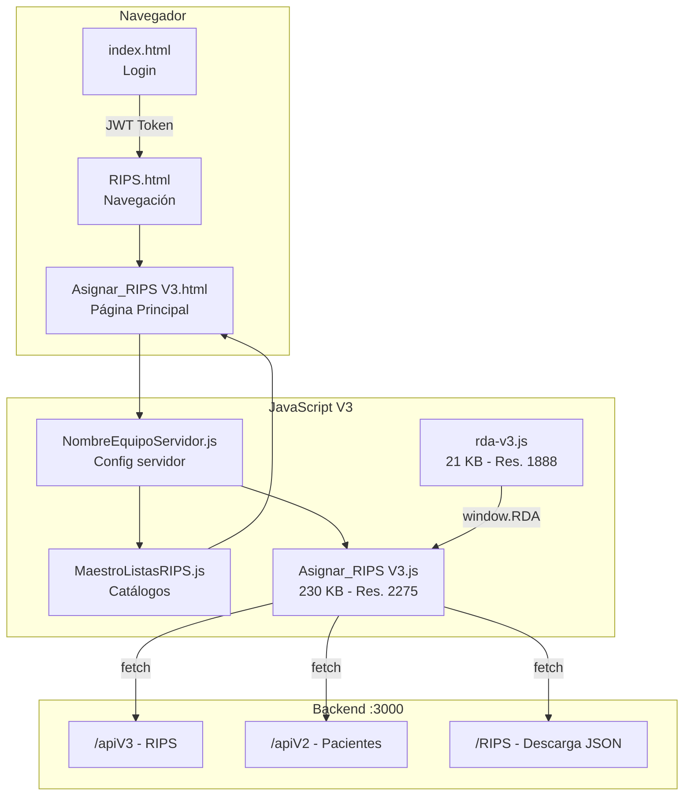
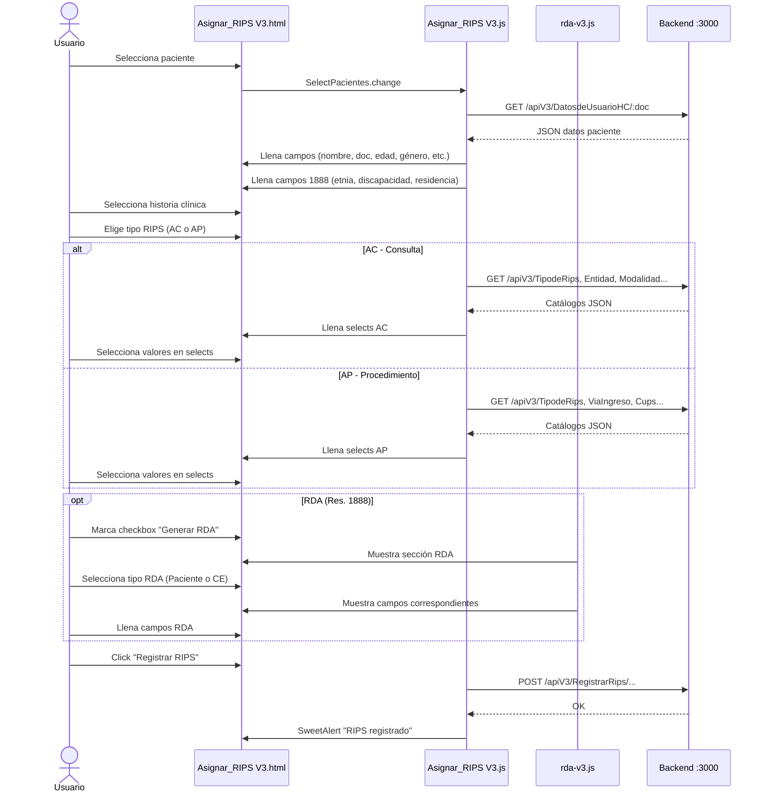
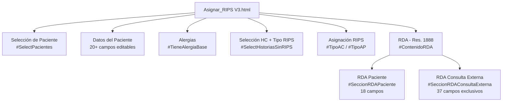

# Arquitectura del Frontend — Versiones y Flujos

## Las 3 generaciones de archivos

El frontend tiene **3 generaciones** de código que coexisten en `front_relacionador/public/`. Solo **V3 es la versión activa**.

| Generación | HTML | JS | Tamaño JS | Estado |
|---|---|---|---|---|
| **V1 (original)** | `Asignar_RIPS.html` | `Asignar_RIPS.js` | 216 KB | ❌ Obsoleta |
| **V2** | `Asignar_RIPS V2.html` | `Asignar_RIPS V2.js` | 217 KB | ❌ Obsoleta |
| **V3 (activa)** | `Asignar_RIPS V3.html` | `Asignar_RIPS V3.js` + `rda-v3.js` | 230 KB + 21 KB | ✅ Activa |

> V1 y V2 se mantienen como referencia histórica pero **NO se deben modificar**.

---

## Archivos del Frontend Activo (V3)

```
front_relacionador/public/
├── Asignar_RIPS V3.html      ← Página principal (114 KB)
├── Asignar_RIPS V3.js        ← Lógica RIPS + datos paciente (230 KB)
├── rda-v3.js                 ← Módulo RDA independiente (21 KB)
├── Asignar_RIPS.css           ← Estilos
├── NombreEquipoServidor.js    ← Config. servidor (localStorage)
├── MaestroListasRIPS.js       ← Catálogos RIPS
├── RIPS.html / RIPS.js        ← Pantalla principal de navegación
├── index.html                 ← Login
├── main.js / script.js        ← Lógica del login
└── style.css / style_login.css ← Estilos generales y login
```

---

## Separación de responsabilidades JS

| Archivo | Responsabilidad |
|---|---|
| `Asignar_RIPS V3.js` | Todo lo de la Res. 2275 (RIPS AC/AP), carga de datos del paciente, selects, registro |
| `rda-v3.js` | Todo lo de la Res. 1888 (RDA), listas dinámicas, biometría, API pública `window.RDA` |
| `NombreEquipoServidor.js` | Define la variable del servidor en `localStorage` |
| `MaestroListasRIPS.js` | Catálogos de opciones para los selects de RIPS |

---

## Diagrama de interacción entre archivos



---

## Flujo completo de asignación de RIPS



---

## Estructura del HTML principal



---

## Orden de carga de scripts (en el HTML)

```html
<!-- 1. Librerías externas -->
<script src="sweetalert2"></script>
<script src="bootstrap"></script>
<script src="alertify"></script>

<!-- 2. Configuración -->
<script src="NombreEquipoServidor.js"></script>

<!-- 3. Lógica principal RIPS (Res. 2275) -->
<script src="Asignar_RIPS V3.js"></script>

<!-- 4. Módulo RDA (Res. 1888) - carga al final -->
<script src="rda-v3.js"></script>
```

> `rda-v3.js` se carga **después** de `Asignar_RIPS V3.js` y se ejecuta inmediatamente (sin `DOMContentLoaded`) porque el DOM ya existe cuando llega al final del `<body>`.

---

## API pública de rda-v3.js

`rda-v3.js` expone un objeto global `window.RDA` que puede ser consultado desde otros archivos:

```javascript
window.RDA = {
    // Getters RDA Paciente
    getAntecedentes: function() { ... },
    getAntecedentesFamiliares: function() { ... },
    getMedicamentosDCI: function() { ... },

    // Getters RDA Consulta Externa
    getDiagRelacionados: function() { ... },
    getPrescripcionMed: function() { ... },
    getPrescripcionProc: function() { ... },
    getOtrasTecnologias: function() { ... }
};
```

Cada getter retorna un array de objetos con los datos de las listas dinámicas.
