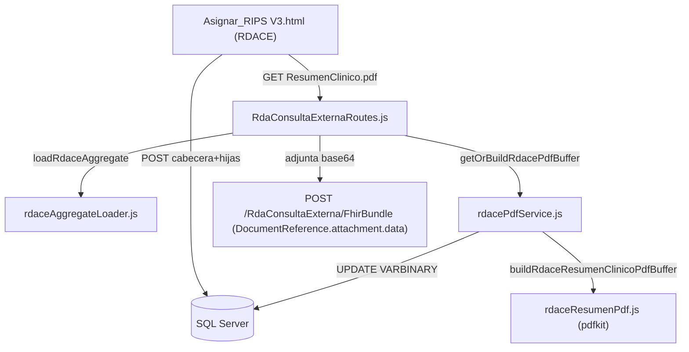

# Mapa de archivos: creación y almacenamiento PDF (RDACE)

Este documento lista **todos los archivos** que intervienen en:

- **Generación** del PDF “Resumen clínico / Epicrisis” para **RDA Consulta Externa (RDACE)**.
- **Persistencia** del PDF en base de datos (`VARBINARY(MAX)`).
- **Exposición** del PDF para descarga y **adjunto** dentro del `Bundle FHIR` (IHCE).

## 1) Base de datos (SQL Server)

- [`back_relacionador/SQL/1888/ALTER_RDACE_ContenidoDocumentoPdf.sql`](back_relacionador/SQL/1888/ALTER_RDACE_ContenidoDocumentoPdf.sql)
  - **Qué hace**: agrega columnas en `[Evaluacion Entidad RDA Consulta Externa]` si no existen:
    - `[Contenido Documento PDF] VARBINARY(MAX) NULL`
    - `[Fecha Generacion Documento PDF] DATETIME2(7) NULL`
  - **Cuándo se usa**: **migración** en ambientes donde la tabla ya existe.

- [`back_relacionador/SQL/1888/Evaluacion Entidad RDA Consulta Externa - CREATE.sql`](back_relacionador/SQL/1888/Evaluacion%20Entidad%20RDA%20Consulta%20Externa%20-%20CREATE.sql)
  - **Qué hace**: crea las tablas RDACE (cabecera + hijas).
  - **Relación con PDF**: la **tabla cabecera** incluye las columnas de PDF (`Nombre Documento PDF`, `Contenido Documento PDF`, `Fecha Generacion Documento PDF`).
  - **Cuándo se usa**: instalación “desde cero” o cuando aún no existen tablas.

## 2) Backend (generación + persistencia + endpoints)

### 2.1 Loader (lectura de datos para PDF/FHIR)

- [`back_relacionador/server/rda/rdaceAggregateLoader.js`](back_relacionador/server/rda/rdaceAggregateLoader.js)
  - **Responsabilidad**:
    - Lee la cabecera RDACE (incluye `Contenido Documento PDF` y `Fecha Generacion Documento PDF`).
    - Lee demografía del paciente desde `[Cnsta Relacionador Usuarios Info]`.
    - Lee tablas hijas: diagnósticos relacionados, prescripciones, procedimientos, otras tecnologías.
    - Lee antecedentes: salud / familiares / farmacológicos.
  - **Salida**: objeto `aggregate` con:
    - `head`, `pdem`, listas hijas
    - `storedPdfBuffer` (si ya existe en BD)
    - `fechaGeneracionPdf`

### 2.2 Generador de PDF (contenido)

- [`back_relacionador/server/rda/rdaceResumenPdf.js`](back_relacionador/server/rda/rdaceResumenPdf.js)
  - **Responsabilidad**: construir el PDF con `pdfkit` como `Buffer`:
    - Encabezado (IPS, paciente, encuentro).
    - Secciones clínicas basadas en lo capturado en RDACE.
    - Secciones “No registrado en sistema” donde hoy no hay campos narrativos (evolución, paraclínicos, plan/recomendaciones).
  - **Garantía “sin clave”**: no se activa cifrado/password en el PDF.

### 2.3 Servicio (get-or-build + persistencia)

- [`back_relacionador/server/rda/rdacePdfService.js`](back_relacionador/server/rda/rdacePdfService.js)
  - **Funciones clave**:
    - `persistRdacePdf(pool, sql, id, buffer)`: hace `UPDATE` en:
      - `[Contenido Documento PDF]`
      - `[Fecha Generacion Documento PDF]`
    - `getOrBuildRdacePdfBuffer({ aggregate, forceRegenerate, reqBody })`:
      - Si `aggregate.storedPdfBuffer` existe y `forceRegenerate=false`, lo reutiliza.
      - Si no existe (o se fuerza), genera con `rdaceResumenPdf.js` y persiste.

### 2.4 Router / endpoints (descarga + FHIR)

- [`back_relacionador/server/routes/rda/RdaConsultaExternaRoutes.js`](back_relacionador/server/routes/rda/RdaConsultaExternaRoutes.js)
  - **Endpoint descarga**:
    - `GET /apiV3/EvaluacionEntidadRDACE/:id/ResumenClinico.pdf`
    - Query opcional: `?regenerar=1` para forzar regeneración del PDF.
  - **Endpoint FHIR**:
    - `POST /apiV3/RdaConsultaExterna/FhirBundle`
    - En `DocumentReference.content[0].attachment.data` se adjunta el **PDF real** (base64) obtenido desde `getOrBuildRdacePdfBuffer(...)`.
    - Body opcional: `regenerarPdf: true` para forzar regeneración del adjunto.

### 2.5 Dependencia

- [`back_relacionador/package.json`](back_relacionador/package.json)
  - **Qué agrega**: dependencia `pdfkit` usada por `rdaceResumenPdf.js`.

## 3) Frontend (UI: nombre, guardar y descarga)

- [`front_relacionador/public/Asignar_RIPS V3.html`](front_relacionador/public/Asignar_RIPS%20V3.html)
  - **Campos / controles**:
    - Input `RDACE_NombreDocumentoPDF` (nombre sugerido del archivo).
    - Hidden `RDACE_IdEvaluacionActual` (guarda el id RDACE de la sesión).
    - Botón `RDACE_BtnDescargarPdf` (descarga manual).
  - **Flujo al guardar RDACE**:
    - Tras guardar cabecera+hijas, fija `RDACE_IdEvaluacionActual`, autocompleta `RDACE_NombreDocumentoPDF` si está vacío y hace **descarga automática** del PDF con:
      - `GET /apiV3/EvaluacionEntidadRDACE/:id/ResumenClinico.pdf`

## 4) Variables de entorno (overrides de IPS para el PDF / FHIR)

- [`back_relacionador/.env.example`](back_relacionador/.env.example)
  - Variables usadas por `rdacePdfService.js` (y coherentes con `FhirBundle`):
    - `IHCE_RDACE_DEFAULT_NIT_IPS`
    - `IHCE_RDACE_DEFAULT_NOMBRE_IPS`
  - **Notas**:
    - En `FhirBundle` también existen overrides por request (`overrideNitPrestadorIPS`, `overrideNombrePrestadorIPS`).

## 5) Documentación de soporte (normativa / alcance)

- [`docs/resolucion-1888/rdace-pdf-decreto780-matriz.md`](docs/resolucion-1888/rdace-pdf-decreto780-matriz.md)
  - **Qué contiene**: matriz de requisitos del **Decreto 780** vs secciones del PDF vs fuentes RDACE, y brechas actuales (campos narrativos).

## 6) Resumen del flujo (alto nivel)

