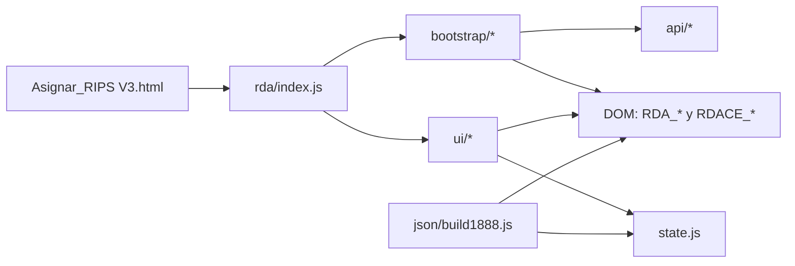

# RDA V3 (Resolución 1888) — Arquitectura y dónde está todo

Este directorio (`front_relacionador/public/rda/`) contiene el **módulo ES** de RDA V3 (Resolución 1888).
La idea es que alguien nuevo pueda ubicar rápidamente:

- dónde está la **lógica de UI**
- dónde está el **estado**
- dónde se arma el **JSON/FHIR**
- dónde se cargan **catálogos / selects**
- qué parte es **arranque/cableado** de la página (lo que antes estaba metido en `Asignar_RIPS V3.js`)

## 0. Cómo se carga en la app (punto de entrada)

En `front_relacionador/public/Asignar_RIPS V3.html` se carga el módulo con:

```html
<script type="module" src="rda/index.js"></script>
```

El archivo `rda/index.js` es el **entrypoint**: inicializa submódulos y expone `window.RDA`.

## 1. Mapa mental (flujo de datos)

En términos simples, el flujo típico es:



- **`ui/*`**: comportamiento de interfaz (secciones, listas, botones).
- **`state.js`**: listas dinámicas en memoria (antecedentes, medicamentos, etc.).
- **`json/build1888.js`**: transforma `state` + valores del DOM en el JSON/FHIR.
- **`api/*`**: helpers para consumir `/apiV3/...` (catálogos y utilidades).
- **`bootstrap/*`**: “cableado de página” (Select2, catálogos, sincronías con RIPS, etc.).

## 2. Estructura del directorio (qué hay dónde)

- **`index.js`**: punto de entrada del módulo.
  - Inicializa submódulos de UI/estado/selecciones.
  - Expone una API pública mínima en **`window.RDA`**.
  - Además ejecuta el *wireup* específico de la página Asignar (ver `bootstrap/`).

- **`state.js`**: estado centralizado (listas en memoria) para RDA Paciente y RDA Consulta Externa.
  - Exporta getters (`getAntecedentes`, etc.) y mutaciones (`add...`, `removeItem`, `resetAll`).

- **`ui/`**: lógica de UI reutilizable del módulo RDA.
  - **`controlRda.js`**: muestra/oculta secciones según tipo RDA (paciente vs consulta externa).
  - **`listasPaciente.js`** y **`listasConsultaExterna.js`**: manejan las listas dinámicas (badges) y su vínculo con `state.js`.
  - **`biometria.js`**: inicialización UI de biometría (si aplica en la pantalla).
  - **`renderBadges.js`**: render de badges, callbacks de eliminación, etc.

- **`api/`**: integraciones simples con el backend (catálogos y utilidades).
  - **`servidor.js`**: `getServidor()` (lee `localStorage.NombreEquipoServidor`).
  - **`selectsRda.js`**: carga selects básicos (prestador / admin plan beneficios) consumiendo `/apiV3/...`.
  - (Si buscas una llamada a `/apiV3/...`, muchas viven en `bootstrap/` porque son parte del “wireup” de la página.)

- **`json/`**
  - **`build1888.js`**: construcción del JSON/FHIR (bundle) según estado + valores del formulario.

- **`bootstrap/`** (importante: NO es “Bootstrap CSS”):
  - Aquí viven los módulos de **arranque/cableado** (*bootstrapping / wiring*) para la página `Asignar_RIPS V3.html`.
  - Su responsabilidad es **conectar DOM + Select2 + fetch + sincronías**, sin meterse en reglas de negocio del JSON.

## 3. ¿Qué significa `bootstrap/` aquí? (y por qué existe)

En este proyecto usamos `bootstrap/` como “código de inicialización”.
Ejemplos típicos:

- inicializar `select2()` en campos `RDA_*` / `RDACE_*`
- poblar catálogos desde `/apiV3/...`
- sincronizar selects de Asignar RIPS (AC/AP) hacia campos RDA/RDACE
- cablear botones (ej. “Actualizar datos paciente”) con su endpoint

Antes, gran parte de este cableado estaba incrustado dentro de `$(document).ready(...)` en `Asignar_RIPS V3.js`.
Ahora está modularizado dentro de `rda/bootstrap/` para mantenerlo escalable.

### Archivos de `bootstrap/`

- **`bootstrap/initAsignarWireup.js`**
  - Orquestador: define el orden de inicialización del wireup en la página Asignar.

- **`bootstrap/wireCieSelect2.js`**
  - Select2 AJAX para CIE-10/CIE-11 usados por RDA/RDACE.
  - Endpoints: `/apiV3/Cie/:term`, `/apiV3/icd11/search/...`.

- **`bootstrap/wireRdaceCatalogs.js`**
  - Select2 y catálogos usados en RDACE (y algunos compartidos con RDA).
  - Ejemplos: `Catalogo1888/:clave`, `EgresoRemision`, `FactorDeRiesgo`, `TipoTecnologiaEnSalud`,
    `MedicamentosDCI`, `Cups1888`, `Profesionales`.

- **`bootstrap/wireSyncRips.js`**
  - Sincronía desde selects de Asignar RIPS hacia:
    - RDA Paciente: modalidad + grupo servicios
    - RDACE: modalidad + grupo + vía ingreso + causa motivo
  - Estrategia: intenta copiar opciones desde selects ya cargados (si existen) y hace *fallback* a `/apiV3/...`.

- **`bootstrap/wireDemografiaPaciente.js`**
  - Select2 de demografía del paciente (país, municipio, tipo documento, sexo, etnia, discapacidad, ocupación, etc.)
  - Botón/lógica de **ActualizarPaciente** (`POST /apiV3/ActualizarPaciente`).

## 4. Dónde buscar según “lo que quiero cambiar”

- **Quiero cambiar la UI (mostrar/ocultar secciones, listas, botones de agregar/quitar)**:
  - mira `ui/controlRda.js`, `ui/listasPaciente.js`, `ui/listasConsultaExterna.js`, `ui/renderBadges.js`.

- **Quiero cambiar qué se guarda / cómo se construye el FHIR/JSON 1888**:
  - mira `json/build1888.js` y `state.js` (las listas que alimentan el builder).

- **Quiero cambiar catálogos / Select2 / endpoints que llenan campos**:
  - si es “RDA puro” (prestador / admin): `api/selectsRda.js`
  - si es “cableado de la página Asignar” (RDA_* / RDACE_*): `bootstrap/*.js`

- **Quiero cambiar la sincronía con RIPS (AC/AP) hacia RDACE**:
  - mira `bootstrap/wireSyncRips.js`

## 5. Cómo “buscar” cosas rápido

### IDs de DOM

- **RDA Paciente** suele usar prefijo `RDA_...`
- **RDA Consulta Externa** suele usar prefijo `RDACE_...`

Si quieres ubicar el código que maneja un campo concreto:

1. Busca el ID en el HTML (`Asignar_RIPS V3.html`).
2. Luego busca ese mismo ID en `rda/` (normalmente estará en `bootstrap/` o en `ui/`).

### Endpoints

La mayoría de llamadas van a `{API_BASE}/apiV3/...` donde la base del API viene de `getApiBaseUrl()` (ver `/config.js` + `apiBaseUrl.js`). Históricamente se usaba el hostname en `localStorage` y el puerto `3000`; ahora es configurable por `.env`.

- `localStorage.getItem("NombreEquipoServidor")` (ver `api/servidor.js`)

### API pública del módulo

`rda/index.js` expone `window.RDA` como contrato mínimo con el resto de la app (ej. para construir bundles):

- `window.RDA.buildPacienteBundle(formValues)`
- getters de listas (`getAntecedentes`, etc.)

## Troubleshooting (cuando algo “no carga”)

- **Select2 no abre / no busca**:
  - Verifica que jQuery y Select2 estén cargados en el HTML (en `head`).
  - Revisa consola: errores de `fetch` (servidor incorrecto o endpoint 404).

- **No se llenan catálogos**:
  - Confirma que `NombreEquipoServidor` existe en localStorage.
  - Prueba el endpoint directo en el backend (`/apiV3/...`).

- **Sincronía RIPS → RDACE no funciona**:
  - Depende de que los selects fuente estén presentes y/o hayan cargado opciones.
  - `wireSyncRips.js` tiene fallback a API y observers, pero si los IDs cambian se rompe.

## Documentación funcional (1888)

Hay documentación complementaria en `docs/resolucion-1888/` (comparaciones, catálogos, etc.).

## 6. Nota importante: scripts inline en el HTML

En `Asignar_RIPS V3.html` existen scripts inline asociados a “Guardar RDA Paciente / Guardar RDACE”.
Esos scripts:

- dependen de los **mismos IDs** `RDA_*` / `RDACE_*`
- leen valores de **Select2** (ej. `select2('data')`)

Por eso el refactor se hizo moviendo el **wireup** (Select2/catálogos/sync) a `rda/`,
pero dejando esos scripts inline intactos para minimizar riesgo de ruptura.

